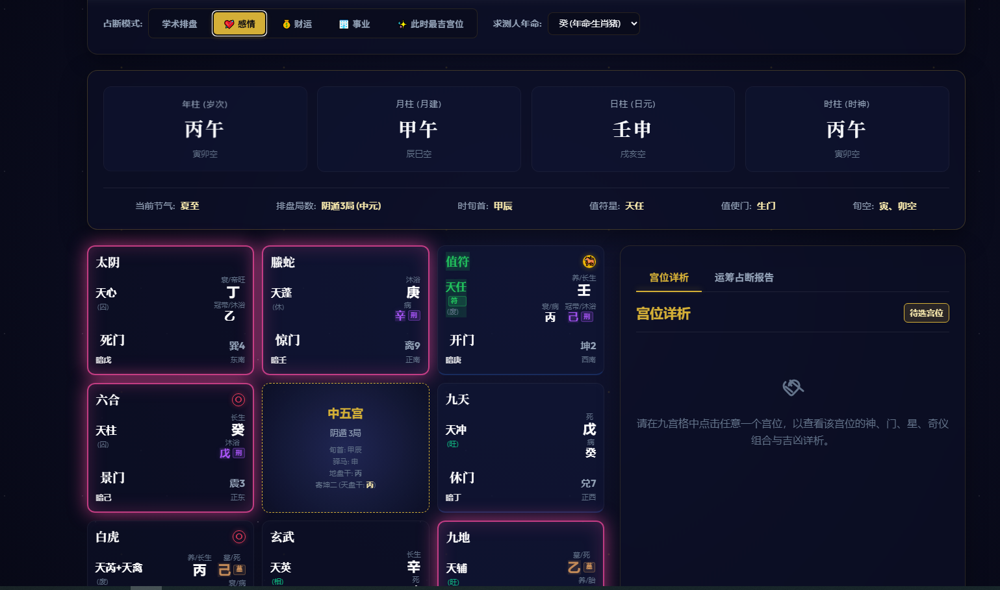
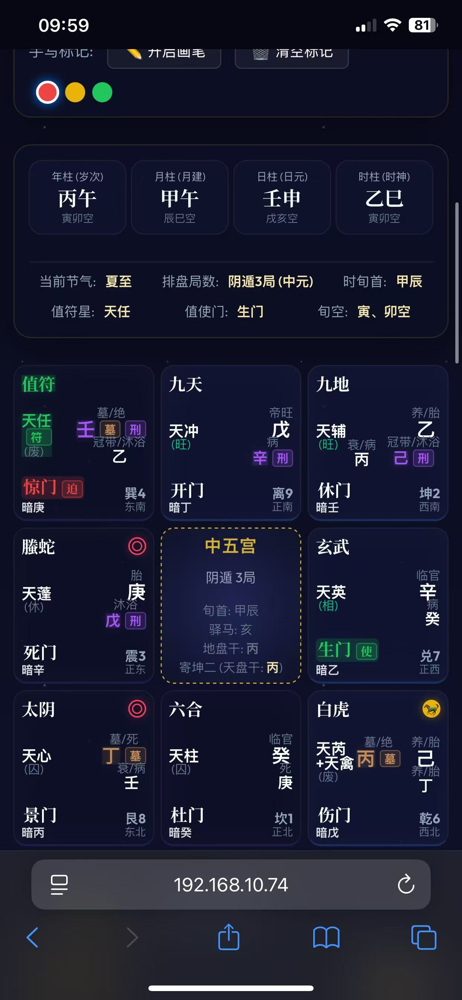

# ☯️ 奇门遁甲智能排盘系统 (Qimen Dunjia System)

> 一个高精度、极客级、全平台自适应的纯前端奇门遁甲排盘工具。

[](#)
[](#)
[](#)

## 📌 项目简介

本项目是一个基于**第一性原理**构建的纯前端（零依赖、无后端）奇门遁甲测算引擎。系统只需输入公历时间，即可在本地瞬间完成极其复杂的太阳黄经计算、推算节气，并精准排出天盘、地盘、八门、九星、八神、旬空及驿马，同时提供详尽的宫位克应合局解析。

**系统采用移动优先 (Mobile-First) 的玻璃拟态 (Glassmorphism) UI 设计**，无论是桌面端大屏还是苹果/安卓极限窄屏手机，均能完美自适应，告别排版拥挤与文字重叠。

---

## 📸 界面预览

> **💡 给指挥官的提示：** 
> 请在 GitHub 网页版点击右上角的 `✏️ (Edit)` 按钮，将你的电脑端或手机端系统截图直接**拖拽**到下方替换这些占位符即可！

### 🖥 桌面端全景


### 📱 手机端适配
<div align="center">
  
</div>

---

## ✨ 核心特性

- **⚡️ 极致轻量，零后端运行**：完全剔除臃肿的 Node.js/数据库 依赖。所有的复杂天文历法与奇门公式均在浏览器前端离线计算，确保绝对的数据隐私与毫秒级响应速度。
- **📱 纳米级移动端优化**：针对 iPhone SE 等极限窄屏深度重构 CSS Grid/Flexbox 布局，根除 iOS 原生控件样式污染与点击闪烁，神煞奇仪在九宫格中排布严丝合缝。
- **🚀 渐进式应用 (PWA) 体验**：支持将网页直接“添加到主屏幕”。在手机端点开图标即可全屏沉浸式运行，享受如同原生 APP 一样的操作质感。
- **🔮 多维占断模式**：内置“学术排盘”、“感情占断”、“财运占断”、“事业决断”及“此时最吉宫位”的高亮筛选算法，搭配极具东方赛博质感的微光呼吸特效。
- **📝 动态手写标记 (Canvas)**：内置在线黑板模式，随时用不同颜色在盘面上圈点勾画，一键导出为高清图片存档。

---

## 🚀 部署与使用指南

本项目 100% 由静态文件组成，你拥有多种极简的运行方式：

### 方案 A：全球极速云部署 (推荐)
点击下方按钮，直接将本项目一键克隆并部署到你自己的 **Vercel** 账号下，永久免费获取全球边缘 CDN 加速的专属公网链接。

[](https://vercel.com/new/clone?repository-url=https%3A%2F%2Fgithub.com%2Fjinb343jinb343%2Fqimen-system)

*(部署完成后，用手机 Safari 打开网址，点击底部“分享 -> 添加到主屏幕”，即可生成原生 App 图标。)*

### 方案 B：本地离线免安装使用
1. 下载本项目的 `.zip` 压缩包并解压。
2. 双击打开 `index.html`，浏览器即刻呈现完美排盘界面，无需任何配置，断网环境下依然完美运行。

---

## 📂 核心文件架构

```text
├── index.html       # 系统主入口 (HTML5 骨架结构)
├── index.css        # 全局样式系统 (Glassmorphism UI, 响应式媒体查询)
├── app.js           # 核心控制器 (UI 交互、Canvas 画板、事件绑定)
├── qimen.js         # 奇门遁甲核心算力引擎 (节气、干支、九宫排布算法)
├── forecast.js      # 占断逻辑解释器 (克应、格局吉凶、多模式诊断)
├── server.js        # [可选] 局域网本地测试服务器
└── vercel.json      # Vercel 云端部署总控配置 (强制静态路由规则)
```

## 🛠 技术栈
- Vanilla JavaScript (ES6+)
- 原生 HTML5 / Canvas API
- CSS3 (Grid / Flexbox / CSS Variables / Animations)

---
*“顺天应时，奇门自开。”*
